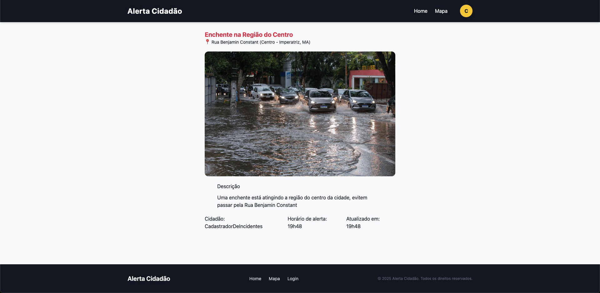
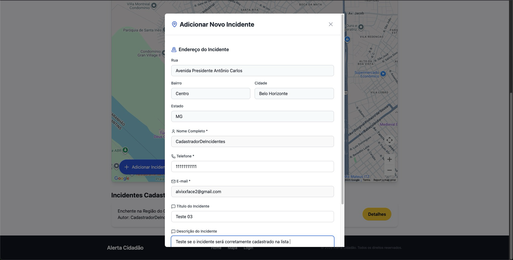
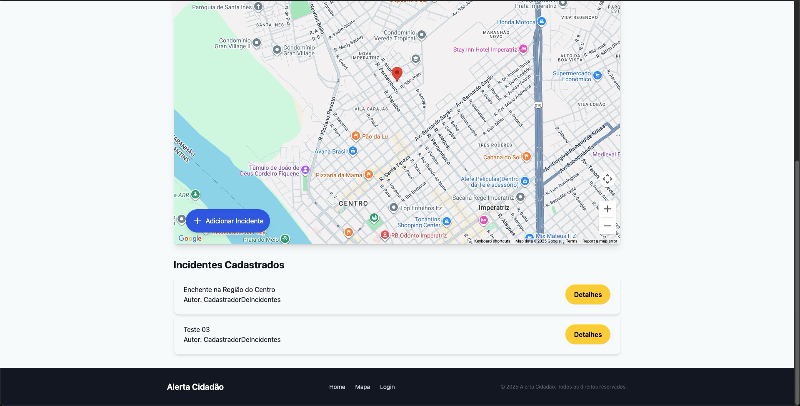

# Registro de Testes de Software

Relatório com as evidências dos testes de software realizados na aplicação pela equipe, baseado no plano de testes pré-definido.

Os resultados dos testes funcionais realizados na aplicação são descritos a seguir.

| Caso de Teste                              | CT-1 - Carregamento correto da página de Incidente |
| :----------------------------------------- | :------------------------------------------------- |
| Resultados obtidos                         | Carregamento da página de incidente sem erros      |
| Responsável pela execução do caso de Teste | Eduardo Moreira                                    |

| Caso de Teste                              | CT-2 - Carregamento incorreto da página de Incidente |
| :----------------------------------------- | :--------------------------------------------------- |
| Resultados obtidos                         | Carregamento da página de incidente sem erros        |
| Responsável pela execução do caso de Teste | Eduardo Moreira                                      |

| Caso de Teste                              | CT-3 - Cadastro de novo incidente                               |
| :----------------------------------------- | :-------------------------------------------------------------- |
| Resultados obtidos                         | Novo incidente adicionado na listagem de incidentes cadastrados |
| Responsável pela execução do caso de Teste | Eduardo Moreira                                                 |

